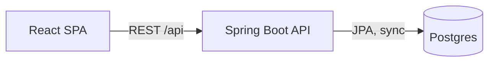
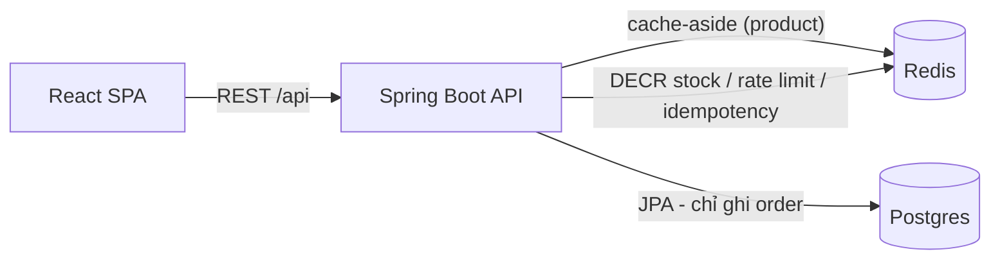
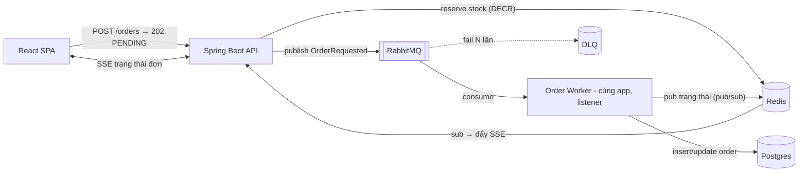
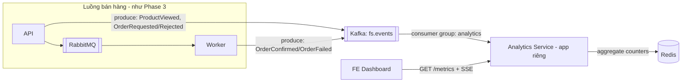
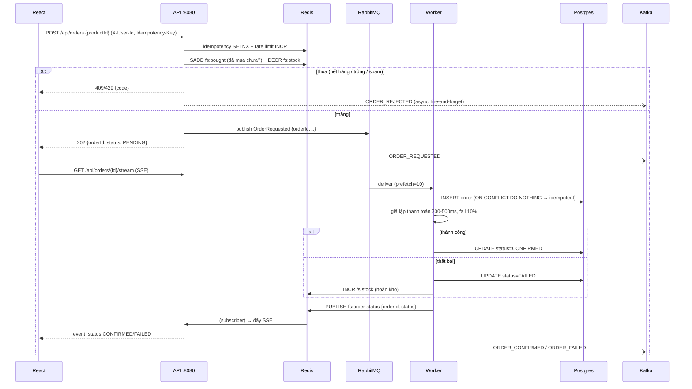

# ARCHITECTURE — Kiến trúc hệ thống

Kiến trúc **tiến hóa theo phase** — mỗi phase thêm đúng 1 mảnh ghép để giải 1 vấn đề đã đo được. Tài liệu này mô tả trạng thái cuối của từng phase và các quy ước đặt tên dùng chung.

## 1. Bối cảnh & yêu cầu nghiệp vụ (rút gọn)

- Có 1 (hoặc vài) sản phẩm flash sale, tồn kho nhỏ (VD 100), lượng mua đồng thời lớn (mô phỏng 500–5000 VUs).
- User (giả lập bằng `X-User-Id` header, không làm auth thật) bấm mua 1 sản phẩm, số lượng 1.
- Yêu cầu cứng: **không bao giờ oversell**; mỗi user mua tối đa 1 đơn/sản phẩm.
- Yêu cầu mềm: API trả lời nhanh (kể cả khi từ chối); user thấy trạng thái đơn của mình cập nhật dần.
- Ngoài luồng bán: dashboard analytics real-time (đơn/phút, tỷ lệ thành công, lượt xem).

## 2. Kiến trúc qua từng phase

### Phase 1 — Naive (baseline để đo cái sai)



Đặt hàng = 1 transaction đồng bộ: đọc stock → nếu còn → insert order + trừ stock. Cố tình viết kiểu SELECT-then-UPDATE để chứng kiến oversell, sau đó fix bằng atomic UPDATE (đúng nhưng nghẽn ở DB).

### Phase 2 — Thêm Redis (đọc nhanh, đếm đúng, chặn spam)



- Tồn kho chuyển lên Redis khi "mở sale" (sale activation). `DECR` atomic quyết định thắng/thua — DB không còn là trọng tài.
- Phần lớn request bị từ chối ngay tại Redis (hết hàng / rate limit / trùng) mà **không chạm DB**.
- DB vẫn ghi order đồng bộ → vẫn nghẽn khâu ghi khi thắng nhiều → dẫn tới Phase 3.

### Phase 3 — Thêm RabbitMQ (giãn tải ghi, xử lý bất đồng bộ)



- API giờ **mỏng**: check Redis → publish → trả `202 Accepted` kèm `orderId` ngay lập tức.
- Worker (Rabbit listener trong cùng app Spring — Phase 5 mới tách nếu muốn) làm việc nặng: ghi DB, giả lập thanh toán (random fail ~10%), cập nhật trạng thái.
- Thanh toán fail → **hoàn kho** (`INCR` lại Redis) — bài học compensation.
- Retry qua retry-queue có TTL; quá N lần → DLQ.
- Trạng thái đơn đẩy về FE qua **SSE**, fanout nội bộ bằng **Redis pub/sub** (học luôn điểm khác giữa pub/sub và queue).

### Phase 4 — Thêm Kafka (event streaming & analytics, tách khỏi luồng chính)



- Kafka là **hệ thần kinh sự kiện**: mọi thứ xảy ra đều được ghi vào topic `fs.events`, luồng bán hàng KHÔNG phụ thuộc vào nó (fire-and-forget, analytics chết thì bán hàng vẫn chạy).
- Analytics là **app Spring Boot riêng** (port 8081), consumer group riêng — để tự tay chạy 2 instance và xem partition rebalance.

## 3. Phân vai công nghệ (rules of thumb rút ra)

| | RabbitMQ | Kafka | Redis pub/sub |
|---|---|---|---|
| Vai trò trong repo | Task queue: "việc cần LÀM đúng 1 lần" | Event log: "chuyện đã XẢY RA, ai quan tâm thì đọc, đọc lại được" | Fanout tức thời, chấp nhận mất (đẩy SSE) |
| Message sau khi xử lý | Biến mất (ack) | Còn nguyên (retention), replay được | Không lưu — ai online mới nhận |
| Consumer scale | Thêm consumer cùng queue | Thêm consumer trong group (≤ số partition) | Mọi subscriber đều nhận hết |

## 4. Data model (Postgres)

```sql
-- V1__init.sql (Flyway)
CREATE TABLE products (
    id          BIGSERIAL PRIMARY KEY,
    name        VARCHAR(255) NOT NULL,
    price       NUMERIC(12,0) NOT NULL,        -- VND, không thập phân
    stock       INT NOT NULL CHECK (stock >= 0),
    sale_active BOOLEAN NOT NULL DEFAULT FALSE,
    created_at  TIMESTAMPTZ NOT NULL DEFAULT now()
);

CREATE TABLE orders (
    id             UUID PRIMARY KEY,            -- API sinh trước, dùng làm idempotency key phía worker
    product_id     BIGINT NOT NULL REFERENCES products(id),
    user_id        VARCHAR(64) NOT NULL,
    status         VARCHAR(20) NOT NULL,        -- PENDING | PROCESSING | CONFIRMED | FAILED
    failure_reason VARCHAR(255),
    created_at     TIMESTAMPTZ NOT NULL DEFAULT now(),
    updated_at     TIMESTAMPTZ NOT NULL DEFAULT now(),
    CONSTRAINT uq_order_user_product UNIQUE (user_id, product_id)  -- 1 user 1 đơn/sản phẩm
);
```

### Vòng đời trạng thái order

```
(API nhận request)
   ├─ từ chối ngay (hết hàng/rate limit/trùng) → KHÔNG tạo order, trả 409/429
   └─ reserve thành công → PENDING (202)
         └─ worker nhận → PROCESSING
               ├─ thanh toán ok  → CONFIRMED
               └─ thanh toán fail → FAILED (+ hoàn kho Redis)
```

## 5. Quy ước đặt tên (naming) — dùng thống nhất từ đầu

### Redis keys — prefix `fs:`

| Key | Kiểu | Ý nghĩa | TTL |
|---|---|---|---|
| `fs:product:{id}` | String (JSON) | Cache thông tin sản phẩm (KHÔNG chứa stock) | 60s + jitter |
| `fs:stock:{productId}` | String (int) | Tồn kho sale — nguồn sự thật khi sale đang chạy | không (xóa khi đóng sale) |
| `fs:bought:{productId}` | Set\<userId\> | User đã mua — chặn mua lần 2 tầng Redis | theo sale |
| `fs:idem:{userId}:{key}` | String | Idempotency key chống double-submit | 10 phút |
| `fs:rl:{userId}:{epochMinute}` | String (int) | Rate limit theo phút | 2 phút |
| `fs:metrics:{metric}:{epochMinute}` | Hash | Counter analytics (Phase 4) | 24h |
| Channel `fs:order-status` | Pub/Sub | Worker → API đẩy SSE | — |

### RabbitMQ topology — prefix `fs.`

| Tên | Loại | Ghi chú |
|---|---|---|
| `fs.order.x` | Direct exchange | durable |
| `fs.order.requested.q` | Queue | binding key `order.requested`, durable |
| `fs.order.requested.retry.q` | Queue | TTL 5s, dead-letter về `fs.order.x` → quay lại queue chính |
| `fs.order.requested.dlq` | Queue | nhận sau khi retry quá `x-retry-count` ≥ 3 |

### Kafka — topic `fs.events`

- Partitions: **3**, replication factor 1 (dev).
- Key = `productId` (đảm bảo event cùng sản phẩm vào cùng partition → có thứ tự).
- Value = JSON envelope thống nhất:

```json
{
  "eventId": "uuid",
  "type": "ORDER_CONFIRMED",       // PRODUCT_VIEWED | ORDER_REQUESTED | ORDER_REJECTED | ORDER_CONFIRMED | ORDER_FAILED
  "occurredAt": "2026-08-18T20:00:00Z",
  "version": 1,
  "payload": { "orderId": "...", "productId": 1, "userId": "u42" }
}
```

## 6. API surface (hình thành dần)

| Endpoint | Phase | Mô tả |
|---|---|---|
| `GET /api/products/{id}` | 0 | Chi tiết sản phẩm (P2: qua cache) + stock hiện tại |
| `POST /api/orders` | 1 | Đặt hàng. P1: sync 201/409. P3: async → `202 {orderId, status}` |
| `GET /api/orders/{id}` | 1 | Trạng thái 1 đơn |
| `GET /api/users/{userId}/orders` | 1 | Đơn của user (trang My Orders) |
| `POST /api/admin/sales/{productId}/activate` | 2 | Mở sale: nạp stock DB → Redis |
| `GET /api/orders/{id}/stream` | 3 | SSE trạng thái đơn |
| `POST /api/events/view` | 4 | FE bắn ProductViewed |
| `GET /api/metrics/summary` (analytics :8081) | 4 | Số liệu dashboard |

Error format thống nhất (mọi lỗi 4xx/5xx):

```json
{ "code": "OUT_OF_STOCK", "message": "Sản phẩm đã hết hàng", "timestamp": "..." }
```

Mã lỗi chính: `OUT_OF_STOCK`, `ALREADY_BOUGHT`, `RATE_LIMITED`, `DUPLICATE_REQUEST`, `SALE_NOT_ACTIVE`, `NOT_FOUND`, `INTERNAL_ERROR`.

## 7. Cấu trúc code

### Backend (`backend/` — Spring Boot, package-by-feature)

```
com.lab.flashsale
├── FlashSaleApplication.java
├── common/            # ApiError, GlobalExceptionHandler, config chung
├── product/           # ProductController, ProductService, ProductRepository, dto/
├── order/             # OrderController, OrderService, OrderRepository, dto/
│   └── worker/        # OrderWorker (Rabbit listener) — Phase 3
├── sale/              # SaleActivationService (nạp Redis) — Phase 2
├── cache/             # RedisConfig, CacheService — Phase 2
├── messaging/         # RabbitConfig (topology), publisher — Phase 3
│   └── kafka/         # KafkaConfig, EventPublisher — Phase 4
└── sse/               # SseController, RedisSubscriber — Phase 3
```

### Frontend (`frontend/src/`)

```
src/
├── api/client.ts      # fetch wrapper: base URL, X-User-Id, error parse
├── features/
│   ├── product/       # ProductPage, useProduct
│   ├── order/         # BuyButton, MyOrdersPage, useOrderStream (SSE)
│   └── dashboard/     # DashboardPage (Phase 4)
├── components/        # UI dùng chung
└── App.tsx            # routes: / , /orders , /dashboard
```

### Analytics (`analytics/` — Phase 4, app Spring Boot riêng)

```
com.lab.analytics
├── consumer/          # FsEventsConsumer (@KafkaListener)
├── metrics/           # MetricsService (Redis), MetricsController (+SSE)
└── AnalyticsApplication.java
```

## 8. Luồng đặt hàng chi tiết (trạng thái cuối — Phase 4)



## 9. Những gì CỐ TÌNH nằm ngoài scope

Để giữ trọng tâm học MQ/Redis/Kafka, repo này **không** làm: auth thật (JWT/OAuth), thanh toán thật, HA/cluster cho Redis/Rabbit/Kafka, Kubernetes, microservice hóa toàn diện, exactly-once semantics của Kafka (chỉ nhắc khái niệm ở Phase 5). Ghi nhớ điều này khi thấy "ngứa tay" muốn thêm.
