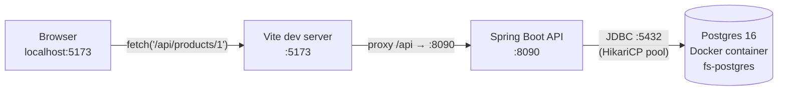

# Implementation Report — Phase 0: Môi trường & Skeleton

> Ngày: 2026-08-18 · Branch: `phase/0-setup` · 8 commits (S2→S8 + docs)
> Mục đích report: đọc lại để hiểu SÂU những gì đã được implement — từng bước làm gì, vì sao, các service nối nhau thế nào, flow đi qua đâu, và từng đoạn code có ý nghĩa gì.

---

## 1. Bức tranh tổng thể sau Phase 0

Ba tiến trình độc lập, nói chuyện với nhau qua network:



### Bảng port & nơi cấu hình

| Thành phần | Port | Cấu hình ở đâu | Ghi chú |
|---|---|---|---|
| Postgres | 5432 | `infra/docker-compose.yml` → `ports` | Container `fs-postgres`, data giữ trong volume `pgdata` |
| Backend API | **8090** | `backend/src/main/resources/application.yml` → `server.port` | ⚠️ Docs quy ước 8080 nhưng máy này 8080 bị app Caris (công việc) chiếm |
| Frontend dev | 5173 | Vite mặc định | Proxy `/api` trỏ sang 8090 trong `vite.config.ts` |

**Quy tắc "phải sửa cùng nhau"**: đổi `server.port` thì PHẢI đổi `vite.config.ts` proxy target theo — đây là 2 đầu của cùng 1 sợi dây.

### Ai phụ thuộc ai lúc khởi động

```
docker compose up -d          → Postgres lên trước, healthcheck pg_isready xác nhận sẵn sàng
./mvnw spring-boot:run        → Boot cần Postgres NGAY lúc start (Hikari + Flyway kết nối liền)
npm run dev                   → Vite không cần BE lúc start; chỉ cần khi browser gọi /api
```

---

## 2. Flow chi tiết

### 2.1 Flow khởi động backend (điều gì xảy ra khi `mvnw spring-boot:run`)

Thứ tự thực tế (đọc được trong log):

1. **HikariCP** tạo connection pool tới `jdbc:postgresql://localhost:5432/flashsale`. Fail ở đây (DB chưa lên) = app chết ngay — vì vậy luôn `docker compose up -d` trước.
2. **Flyway** chạy TRƯỚC Hibernate: khóa bảng `flyway_schema_history`, so checksum các file `V*__*.sql` đã áp, áp file mới nếu có. Lần đầu: tạo `products`, `orders` (V1) rồi seed (V2). Lần sau: "Schema is up to date", **nhưng nếu bạn SỬA file V1 đã áp → checksum lệch → app từ chối start**. Đây là tính năng, không phải bug: lịch sử schema là bất biến, muốn đổi thì viết V3.
3. **Hibernate** khởi động với `ddl-auto: validate`: đọc metadata các `@Entity`, so với schema thật trong DB. Khớp → đi tiếp; lệch (ví dụ entity có field mà bảng không có cột) → fail ngay lúc start thay vì lỗi runtime lúc nửa đêm.
4. **Tomcat** (nhúng) bind port 8090 và bắt đầu nhận request. Actuator expose `/actuator/health`.

### 2.2 Flow một request THÀNH CÔNG: mở trang → thấy sản phẩm

```
[React]  ProductPage render lần đầu
   └─ useProduct(1) → useEffect chạy → api.get('/products/1')
        └─ client.ts: fetch('/api/products/1', headers: {X-User-Id: 'u1', ...})
[Vite :5173]  thấy path bắt đầu bằng /api → chuyển tiếp nguyên văn sang http://localhost:8090
[Spring :8090]
   DispatcherServlet nhận GET /api/products/1
   └─ match @RequestMapping("/api/products") + @GetMapping("/{id}")
      → ProductController.getProduct(1)
        → ProductService.getProduct(1)
          → ProductRepository.findById(1)     ← interface, Spring Data tự sinh implementation
            → Hibernate sinh SQL: SELECT ... FROM products WHERE id=?
              → mượn connection từ Hikari pool → Postgres thực thi → trả row
          ← Optional<Product> có giá trị
        ← service map Product (entity) → ProductResponse (record DTO)
      ← Jackson serialize record → JSON
   ← HTTP 200 {"id":1,"name":"iPhone Flash Sale","price":15000000,"stock":100,"saleActive":false}
[Vite]   trả response về browser (browser tưởng là cùng origin 5173 — không có CORS)
[React]  .then(setData) → loading=false → re-render → hiển thị tên + giá VND + stock
```

### 2.3 Flow một request LỖI: id không tồn tại

```
GET /api/products/999
→ ProductRepository.findById(999) → Optional.empty()
→ ProductService: .orElseThrow(() -> new NotFoundException("Không tìm thấy sản phẩm id=999"))
→ exception BAY XUYÊN QUA controller (controller không try-catch — cố ý, RULES B5)
→ DispatcherServlet bắt được, tìm @RestControllerAdvice
→ GlobalExceptionHandler.handleNotFound() → HTTP 404 + ApiError{code:"NOT_FOUND", message, timestamp}
→ client.ts: res.ok == false → parse body → throw new ApiError(404, body)
→ useProduct: .catch → setError(e.message) → UI hiện thông báo lỗi đỏ
```

Điểm mấu chốt: **mã lỗi (`NOT_FOUND`) sinh ra ở đúng MỘT nơi** (GlobalExceptionHandler), FE parse ở đúng MỘT nơi (client.ts). Phase 1–2 thêm `OUT_OF_STOCK`, `ALREADY_BOUGHT`, `RATE_LIMITED`... chỉ việc thêm exception + 1 handler, không đụng controller nào.

---

## 3. Từng bước đã làm (S1 → S8)

| Step | Làm gì | Vì sao / Verify thế nào |
|---|---|---|
| S1 | Verify Java 21.0.2, Node 24, Docker Compose 5.3.1; cài k6 2.2.0 (`winget install GrafanaLabs.k6`) | k6 là công cụ ĐO — triết lý repo: mọi cải tiến phải có số liệu trước/sau |
| S2 | `git init`, tạo `infra/ backend/ frontend/ loadtest/`, `.gitignore`, commit docs, branch `phase/0-setup` | Docs vào git trước tiên → mọi thay đổi kế hoạch có lịch sử |
| S3 | `docker-compose.yml` chỉ có Postgres + healthcheck + named volume | Verify: `pg_isready` OK, `psql SELECT version()` trả 16.15 |
| S4 | Scaffold Spring Boot (pin 3.5.16), `application.yml`, port 8090 | Verify: `/actuator/health` → `{"status":"UP"}` |
| S5 | `V1__init.sql` (schema), `V2__seed.sql` (1 sản phẩm) | Verify: `flyway_schema_history` 2 dòng success; bảng + seed có thật trong DB |
| S6 | `product/` (entity→repo→service→controller→DTO) + `common/` (ApiError, handler) | Verify: id=1 → 200 đúng JSON; id=999 → 404 đúng format §6 |
| S7 | Vite react-ts scaffold, proxy `/api`→8090, `api/client.ts` + `api/types.ts` | Verify: `npm run dev` lên 5173 |
| S8 | `useProduct` hook + `ProductPage` + format VND, dọn boilerplate | Verify: `curl localhost:5173/api/products/1` qua proxy → 200 (đúng con đường browser đi) |

---

## 4. Giải thích code từng file

### 4.1 `infra/docker-compose.yml`

```yaml
services:
  postgres:
    image: postgres:16-alpine        # alpine = nhỏ (~240MB vs ~430MB), đủ cho dev
    container_name: fs-postgres      # tên cố định để docker exec fs-postgres ... không phải đoán
    ports:
      - "5432:5432"                  # "host:container" — máy thật gọi localhost:5432 là vào container
    environment:
      POSTGRES_USER: flashsale       # 3 biến này CHỈ có tác dụng lần khởi tạo ĐẦU TIÊN
      POSTGRES_PASSWORD: flashsale   # (khi volume còn trống). Đổi sau đó phải xóa volume.
      POSTGRES_DB: flashsale
    volumes:
      - pgdata:/var/lib/postgresql/data   # named volume: data sống sót qua `compose down`
    healthcheck:
      test: ["CMD-SHELL", "pg_isready -U flashsale -d flashsale"]
      interval: 5s      # 5s hỏi một lần
      timeout: 3s       # mỗi lần hỏi chờ tối đa 3s
      retries: 10       # 10 lần fail liên tiếp mới coi là unhealthy

volumes:
  pgdata:               # khai báo volume (Docker quản lý, xem bằng `docker volume ls`)
```

**Ý nghĩa healthcheck**: Postgres "container đã chạy" ≠ "DB sẵn sàng nhận kết nối" (initdb mất vài giây). `pg_isready` phân biệt được 2 trạng thái đó. Từ Phase 2, service khác sẽ khai `depends_on: postgres: condition: service_healthy` — chờ ĐÚNG sự kiện thay vì `sleep 10` cầu may.

### 4.2 `backend/pom.xml`

```xml
<parent>
    <groupId>org.springframework.boot</groupId>
    <artifactId>spring-boot-starter-parent</artifactId>
    <version>3.5.16</version>   <!-- pin TAY: start.spring.io đã bỏ 3.x, chỉ còn 4.x -->
</parent>
```
`parent` là "bảng phiên bản trung tâm": mọi dependency bên dưới KHÔNG ghi version — parent quyết định bộ version đã được test tương thích với nhau (Hibernate 6.6, Flyway 11, Tomcat 10.1...).

| Dependency | Kéo vào những gì | Dùng để |
|---|---|---|
| `spring-boot-starter-web` | Spring MVC + Tomcat nhúng + Jackson | REST API, serialize JSON |
| `spring-boot-starter-data-jpa` | Hibernate + Spring Data + HikariCP | ORM + repository tự sinh + connection pool |
| `spring-boot-starter-validation` | Hibernate Validator | `@Valid` cho request body (dùng từ Phase 1) |
| `spring-boot-starter-actuator` | endpoint quản trị | `/actuator/health` — DoD S4, sau này k6 warm-up check |
| `flyway-core` + `flyway-database-postgresql` | migration engine | Flyway 10+ tách driver từng DB ra module riêng → cần CẢ HAI |
| `postgresql` (scope `runtime`) | JDBC driver | compile không cần biết driver, chạy mới cần → runtime |

### 4.3 `backend/src/main/resources/application.yml`

```yaml
server:
  port: 8090            # deviation có chủ đích: 8080 bị app Caris chiếm trên máy này

spring:
  datasource:
    url: jdbc:postgresql://localhost:5432/flashsale   # khớp compose: port 5432, db flashsale
    username: flashsale
    password: flashsale

  jpa:
    hibernate:
      ddl-auto: validate   # ⭐ quyết định quan trọng nhất file này
    open-in-view: false
```

- `ddl-auto` có các mức: `none` / `validate` / `update` / `create` / `create-drop`. Chọn **`validate`** nghĩa là: *schema là tài sản của Flyway, Hibernate chỉ được QUYỀN ĐỌC-SO-SÁNH*. `update` (mặc định nhiều tutorial dùng) để Hibernate tự sửa DB theo entity — tiện lúc đầu, thảm họa về sau: không có lịch sử, không rollback được, mỗi máy một schema khác nhau. Đây chính là đáp án câu tự kiểm #1.
- `open-in-view: false`: mặc định Spring giữ session Hibernate mở suốt tới khi render xong response để "cứu" lazy-loading — nghe tiện nhưng giấu N+1 query và giữ connection lâu hơn cần thiết. Tắt đi = ép mình lấy đủ data trong service, lỗi lộ ra sớm.

### 4.4 `V1__init.sql` — schema

```sql
CREATE TABLE products (
    id          BIGSERIAL PRIMARY KEY,          -- tự tăng (sequence), map GenerationType.IDENTITY
    name        VARCHAR(255) NOT NULL,
    price       NUMERIC(12,0) NOT NULL,         -- tiền KHÔNG BAO GIỜ dùng float/double
                                                -- (0.1+0.2≠0.3); VND không lẻ → 0 chữ số thập phân
    stock       INT NOT NULL CHECK (stock >= 0),-- hàng rào CUỐI CÙNG chống stock âm ở tầng DB
    sale_active BOOLEAN NOT NULL DEFAULT FALSE,
    created_at  TIMESTAMPTZ NOT NULL DEFAULT now()  -- TIMESTAMPTZ = lưu UTC (RULES B10)
);

CREATE TABLE orders (
    id             UUID PRIMARY KEY,            -- ⭐ API sinh TRƯỚC khi ghi DB —
                                                -- Phase 3 worker dùng làm idempotency key
                                                -- (INSERT ... ON CONFLICT DO NOTHING)
    product_id     BIGINT NOT NULL REFERENCES products(id),
    user_id        VARCHAR(64) NOT NULL,
    status         VARCHAR(20) NOT NULL,        -- PENDING | PROCESSING | CONFIRMED | FAILED
    failure_reason VARCHAR(255),
    created_at     TIMESTAMPTZ NOT NULL DEFAULT now(),
    updated_at     TIMESTAMPTZ NOT NULL DEFAULT now(),
    CONSTRAINT uq_order_user_product UNIQUE (user_id, product_id)
    -- ↑ "1 user 1 đơn/sản phẩm" — tầng chặn cuối. Phase 2 sẽ có thêm tầng Redis (SISMEMBER
    -- fs:bought) chặn SỚM; nhưng DB constraint vẫn cần: Redis có thể mất data (restart).
);
```

`CHECK (stock >= 0)` đáng chú ý: Phase 1 ta sẽ CỐ TÌNH viết code oversell — nhưng oversell kiểu SELECT-then-UPDATE làm stock trừ về 0 nhiều lần chứ không âm, nên CHECK không cứu được oversell. Nó chỉ chặn bug "trừ quá tay" thô bạo. Hiểu rõ giới hạn từng tầng bảo vệ là nội dung chính Phase 1–2.

### 4.5 `common/` — khung lỗi dùng cho MỌI phase sau

**`ApiError.java`** — hình dạng lỗi thống nhất (ARCHITECTURE §6):

```java
public record ApiError(String code, String message, Instant timestamp) {
    public static ApiError of(String code, String message) {
        return new ApiError(code, message, Instant.now());
    }
}
```
`record` = class bất biến: tự có constructor, getter, equals/hashCode. Jackson serialize record thành JSON y như POJO. Static factory `of(...)` để khỏi lặp `Instant.now()` ở mọi chỗ.

**`NotFoundException.java`** — extends `RuntimeException` (unchecked): ném xuyên qua các tầng không cần khai `throws`, để DispatcherServlet bắt ở rìa ngoài cùng.

**`GlobalExceptionHandler.java`**:

```java
@RestControllerAdvice          // "advice" áp cho MỌI @RestController trong app
public class GlobalExceptionHandler {

    @ExceptionHandler(NotFoundException.class)   // gặp exception loại này...
    @ResponseStatus(HttpStatus.NOT_FOUND)        // ...trả HTTP 404...
    public ApiError handleNotFound(NotFoundException e) {
        return ApiError.of("NOT_FOUND", e.getMessage());   // ...với body ApiError
    }

    @ExceptionHandler(Exception.class)           // lưới an toàn cuối: MỌI lỗi chưa lường trước
    @ResponseStatus(HttpStatus.INTERNAL_SERVER_ERROR)
    public ApiError handleUnexpected(Exception e) {
        log.error("Loi khong mong doi", e);      // log ĐỦ stacktrace cho dev...
        return ApiError.of("INTERNAL_ERROR", "Có lỗi xảy ra, vui lòng thử lại sau");
        // ...nhưng KHÔNG lộ chi tiết nội bộ (stacktrace, SQL) ra client
    }
}
```
Nhờ class này, controller/service **không có một dòng try-catch nào** — ném exception nghiệp vụ và quên đi. Phase 1 thêm `OutOfStockException` → chỉ cần thêm 1 handler 4 dòng.

### 4.6 `product/` — feature đầu tiên, mẫu cho mọi feature sau

**`Product.java`** (entity):

```java
@Entity
@Table(name = "products")          // map class ↔ bảng products
public class Product {
    @Id
    @GeneratedValue(strategy = GenerationType.IDENTITY)  // IDENTITY = để DB tự tăng (BIGSERIAL)
    private Long id;

    @Column(nullable = false)
    private BigDecimal price;      // NUMERIC ↔ BigDecimal (không bao giờ double cho tiền)

    @Column(name = "sale_active", nullable = false)      // Java camelCase ↔ DB snake_case
    private boolean saleActive;

    @Column(name = "created_at", insertable = false, updatable = false)
    private Instant createdAt;     // DB tự DEFAULT now() — app không được ghi cột này

    protected Product() {}         // JPA bắt buộc có constructor rỗng;
                                   // protected để không ai `new Product()` bừa ngoài package
    // ... chỉ có getter, CHƯA có setter — Phase 1 cần sửa stock mới thêm, thêm-khi-cần
}
```

**`ProductRepository.java`**:

```java
public interface ProductRepository extends JpaRepository<Product, Long> {}
```
Chỉ là interface — **Spring Data sinh implementation lúc runtime** (proxy). `JpaRepository<Product, Long>` cho không `findById`, `save`, `findAll`... Phase 1 sẽ thêm method `@Modifying @Query("UPDATE ...")` vào đây — lúc đó bạn sẽ thấy giá trị thật của tầng này.

**`ProductService.java`**:

```java
@Service
public class ProductService {
    private final ProductRepository productRepository;   // final = bắt buộc gán 1 lần

    public ProductService(ProductRepository productRepository) {  // constructor injection (B2):
        this.productRepository = productRepository;               // 1 constructor duy nhất →
    }                                                             // Spring tự inject, khỏi @Autowired

    public ProductResponse getProduct(long id) {
        Product product = productRepository.findById(id)
                .orElseThrow(() -> new NotFoundException("Không tìm thấy sản phẩm id=" + id));
        return toResponse(product);   // ⭐ entity DỪNG ở đây — ra ngoài chỉ có DTO (B3)
    }
}
```
Vì sao entity không được ra controller? (1) Serialize entity = lộ mọi cột kể cả cột sau này nhạy cảm; (2) đổi tên field entity làm gãy API contract ngầm; (3) lazy-loading nổ giữa lúc serialize. DTO record là "hợp đồng public" — entity là "chuyện nội bộ".

**`ProductController.java`**:

```java
@RestController                        // = @Controller + @ResponseBody: return value → JSON
@RequestMapping("/api/products")       // prefix chung cho mọi method trong class
public class ProductController {
    @GetMapping("/{id}")               // ghép prefix → GET /api/products/{id}
    public ProductResponse getProduct(@PathVariable long id) {   // {id} trong URL → tham số
        return productService.getProduct(id);
    }
}
```
Controller **mỏng cố ý**: nhận request → gọi service → trả DTO. Không logic, không try-catch. Mọi thứ thông minh nằm ở service (dễ unit test — không cần giả lập HTTP).

### 4.7 Frontend

**`vite.config.ts`**:

```ts
server: {
  proxy: {
    '/api': 'http://localhost:8090',
  },
},
```
Browser chặn `fetch` cross-origin (5173 → 8090 là 2 origin khác nhau) trừ khi server cài CORS header. Thay vì mở CORS ở backend (config thừa chỉ để phục vụ dev), ta cho **Vite làm reverse proxy**: browser luôn gọi `5173/api/...` (cùng origin — hợp lệ), Vite chuyển tiếp hộ. Server-to-server không bị luật CORS ràng buộc. Đây là đáp án câu tự kiểm #2. (Production sau này: nginx làm đúng vai trò proxy này.)

**`api/types.ts`** — khai báo `ProductResponse`, `ApiErrorBody` khớp TAY với DTO backend (RULES C5). Không codegen cho project học — tự sync để "cảm" được contract.

**`api/client.ts`** — chốt chặn duy nhất ra network (RULES C2):

```ts
const USER_ID = 'u1'   // giả lập đăng nhập; P1.S2 thay bằng input + localStorage

export class ApiError extends Error {          // lỗi CÓ CẤU TRÚC, không chỉ string
  readonly code: string                        // FE sẽ switch theo code: OUT_OF_STOCK → đổi nút,
  readonly status: number                      // RATE_LIMITED → hiện đếm ngược... (Phase 2)
  ...
}

async function request<T>(path: string, init?: RequestInit): Promise<T> {
  const res = await fetch(`${BASE_URL}${path}`, {
    ...init,
    headers: {
      'Content-Type': 'application/json',
      'X-User-Id': USER_ID,                    // MỌI request tự động có header giả lập user
      ...init?.headers,                        // spread SAU → caller override được khi cần
    },
  })
  if (!res.ok) {
    const body = (await res.json().catch(() => null)) as ApiErrorBody | null
    // .catch(null): phòng thủ khi body không phải JSON (proxy chết, HTML error page...)
    throw new ApiError(res.status, body)
  }
  return res.json() as Promise<T>
}

export const api = {
  get:  <T>(path: string) => request<T>(path),
  post: <T>(path: string, body?: unknown) => request<T>(path, {...}),
}
```
Generic `<T>`: chỗ gọi viết `api.get<ProductResponse>('/products/1')` → TypeScript biết kiểu trả về, autocomplete + bắt lỗi compile-time.

**`features/product/useProduct.ts`** — server state gói trong hook (RULES C4):

```ts
export function useProduct(id: number): UseProductResult {
  const [data, setData] = useState<ProductResponse | null>(null)
  const [loading, setLoading] = useState(true)
  const [error, setError] = useState<string | null>(null)

  useEffect(() => {
    let cancelled = false        // ⭐ chống race: nếu component unmount (hoặc id đổi)
                                 // trước khi fetch xong → bỏ kết quả, không setState mồ côi
    api.get<ProductResponse>(`/products/${id}`)
      .then((p) => { if (!cancelled) setData(p) })
      .catch((e) => { if (!cancelled) setError(...) })
      .finally(() => { if (!cancelled) setLoading(false) })

    return () => { cancelled = true }   // cleanup chạy khi unmount / id đổi
  }, [id])                              // dependency: id đổi → fetch lại

  return { data, loading, error }
}
```
Ghi chú thú vị: `main.tsx` bọc `<StrictMode>` nên **ở chế độ dev effect chạy 2 lần** (React cố tình mount–unmount–mount để phát hiện side effect bẩn) → thấy 2 request trong tab Network là ĐÚNG, không phải bug. Cờ `cancelled` xử lý sạch chuyện này.

**`ProductPage.tsx`**:

```tsx
const formatVnd = (value: number) =>
  new Intl.NumberFormat('vi-VN', { style: 'currency', currency: 'VND' }).format(value)
  // 15000000 → "15.000.000 ₫" — chuẩn i18n của browser, không tự nối chuỗi

const { data: product, loading, error } = useProduct(1)
if (loading) return <p>Đang tải…</p>          // 3 early-return: component chỉ còn
if (error)   return <p>{error}</p>            // đúng 1 việc — RENDER,
if (!product) return null                     // không dính dáng fetch/state machine

<button className="product-buy" disabled>Mua ngay</button>
// disabled chờ Phase 1 (POST /api/orders) — P1.S2 sẽ gắn onClick
```

---

## 5. Quyết định & sự cố đáng nhớ (đọc lại trước Phase 1)

1. **Port 8090 thay vì 8080** — 8080 bị `com.clt.caris.CarisApplication` (app công việc) chiếm. Bài học phụ: cách điều tra — `Get-NetTCPConnection -LocalPort 8080` tìm PID → `Win32_Process` xem CommandLine → quyết định KHÔNG kill process lạ.
2. **start.spring.io đã bỏ Boot 3.x** → pom pin tay `3.5.16` (Maven Central giữ artifact vĩnh viễn). Đừng nghe IDE dụ upgrade lên 4.x giữa chừng dự án học.
3. **Kill `mvnw spring-boot:run` không giết process java con** → port bị giữ → "Port already in use" ma quái. Nhận diện: response trả về là format lỗi MẶC ĐỊNH của Spring (`{"timestamp","status","error","path"}`) thay vì `ApiError` của ta = code CŨ đang chạy.
4. **Windows filesystem không phân biệt hoa/thường**: đổi tên `FlashsaleApplication.java` → `FlashSaleApplication.java` bằng cách ghi file mới rồi xóa file cũ = mất cả hai (cùng 1 file trên disk!). Phải xóa trước, ghi sau.

## 6. Móc nối sang câu hỏi tự kiểm Phase 0

1. *Flyway vs `ddl-auto: update`* → đọc lại §4.3 và mục 2.1 bước 2–3.
2. *Vì sao proxy thay vì gọi thẳng?* → §4.7 phần vite.config.ts.
3. *Request đi qua những class nào?* → §2.2, tự vẽ lại bằng tay không nhìn report.

> Phase 1 report sẽ nằm ở `docs/reports/phase-1-naive.md` sau khi phase đó xong.
